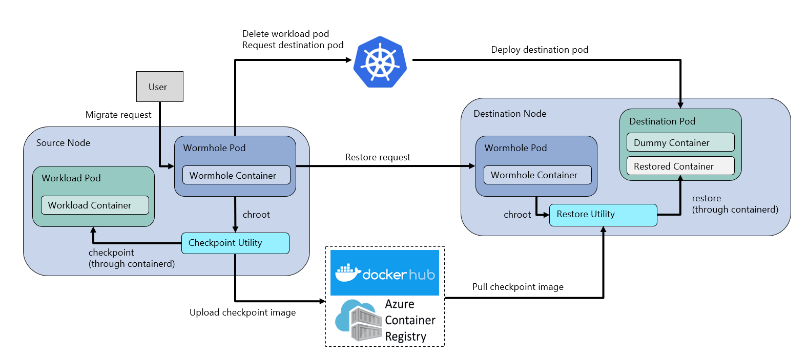

# Project Wormhole
Live migration of containers between Mariner Linux hosts on Azure Kubernetes Service. 
## Architecture

Wormhole pods are deployed on the source and destination nodes to enable migration. Checkpoint and restore utilities are utilized on the host machine to access the containerd container runtime.
### File I/O Workload
A toy file I/O Go application for demonstrating the transfer of container state between nodes.
### Experiments
Explorations of potential aspects of the live migration workflow.